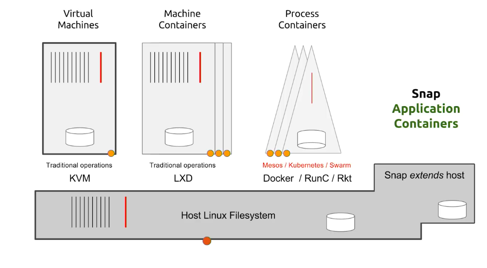

# 1. Snap 에 대한 소개와 데비안 패키지, 컨테이너 등과의 대략적인 비교

Snap은 Canonical에서 개발한 범용 리눅스 패키지 포맷입니다. 오늘날 Ubuntu 에서 기본적으로 지원이 되고 있고, 일부 기본 탑제 앱과 보안 패치 등이 Snap을 통해 제공이 되고 있기도 합니다.
리눅스 배포판별로 제공되는 패키지 관리자나 포맷 (Debian 계열 deb패키지와 apt, dpkg 등과 RedHat 계열 rpm, yum 등)이 보통 해당 배포판에서만 이용 가능한 것과 달리, Snap은 대다수의 배포판에 설치하여 이용이 가능하고, 또 배포판 버전별로 따로 패키징을 하지 않아도 된다는 특징이 있습니다. 데스크톱, 클라우드 및 사물인터넷 등 다양한 환경에서 Snap을 사용할 수 있는데 이러한 Snap의 주요한 특징은 아래와 같습니다.

- 독립적(self-contained)으로 작동
    - 패키지 내부에 프로그램 구동에 필요한 라이브러리나 구성 파일 등의 의존성이 미리 포함되어 있고, 샌드박스 처리가 되어 있어 Snap 패키지가 설치되는 리눅스 배포판 환경에 상관 없이 구동이 가능합니다.
- 트랜젝션 방식 업데이트
    - Snap 은 트랜젝션 방식으로 패키지를 업데이트 하기에, 패키지 업데이트 작업이 실패하면 직전의 정상 작동하는 버전의 패키지로 자동으로 복구가 됩니다. 이를 통해 패키지를 좀 더 안전하게 업데이트 할 수 있습니다.
- 격리(Confined)된 실행 환경 
    - 각 Snap 패키지의 실행 환경은 오늘날 흔히 사용하는 리눅스 컨테이너처럼 격리가 되어 있습니다. 그러다 보니 기본적으로 시스템 자원 접근이 제한되어 있어 Snap 패키지의 프로그램을 더 안전한 환경에서 실행할 수 있습니다. 필요에 따라 Snap 에서 제공하는 Interface 기능으로 시스템 자원 접근을 부분적으로 허용할 수 있습니다. 
- 효율적이고 자동화된 업데이트
    - Snap 패키지는 기본적으로 의존성을 함께 포함한 방식이여서 의존성이 별도 패키지로 설치되는 기존 리눅스 패키지와 달리 크기가 크지만, 증분 업데이트(differential update 혹은 delta update)로 패키지 업데이트 시 달라진 부분만 업데이트 하여 업데이트를 효율적으로 할 수 있습니다. 또한 Snap 패키지는 기본적으로 자동 업데이트 되며, 이는 Snap 패키지가 많이 활용되기도 하는 분야인 사물인터넷 쪽에서 유용하게 사용될 수 있습니다.

## Snapd와 Snapcraft
Snap 에 크게 두 가지 CLI 도구가 있습니다. Snapd와 Snapcraft입니다.

### Snapd

- https://github.com/snapcore/snapd
- https://snapcraft.io/docs

Snapd 는 Snap 패키지를 설치, 사용, 관리 하기 위한 CLI 도구이자, 백그라운드에서 작동하는 데몬 입니다. 데몬으로 작동 하면서, 격리 정책(Confinement policy)을 관리하여 Snap 패키지가 허용된 시스템 자원만 접근 하도록 허용 하거나, 자동 업데이트 등도 관리하는 역할을 합니다.

### Snapcraft

- https://github.com/canonical/snapcraft
- https://snapcraft.io/docs/snapcraft

Snapcraft 는 Snap 패키지를 빌드 및 배포하기 위한 CLI 도구입니다. 기본적으로 Snap 패키지 빌드 구성을 정의한 파일인 `snapcraft.yaml` 을 기반으로 Snap 패키지를 빌드하는 역할을 하며, 필요에 따라 빌드할 때 LXD, Multipass 등 격리된 환경에서 빌드 하도록 지정도 가능하고(기본적으로 LXD). 필요에 따라 Launchpad build farm 에서 빌드하는 기능도 포함 되어 있습니다.

Snap 은 의존성을 미리 포함하고, 실행 환경이 격리되어 있어 데스크톱, 서버, IoT 등 여러 환경 중 어느 환경에서 실행할 것이지에 따라 패키징 방법에 차이가 있고 때로는 직접 작업하기에 복잡한 경우도 있는데, Plugin 및 Extension 기능으로 각 프로그래밍 언어나 플랫폼별로 쉽게 패키징 할 수 있도록 지원하기도 합니다.

## Snap 과 기존 deb 패키지 비교

- 의존성: Snap 은 의존성을 패키지 하나에 번들링 한 형태 이지만, deb 패키지는 의존성 패키지가 별도로 있고 패키지 설치 시 필요에 따라 함께 설치 됩니다.
- 배포판 릴리즈별 빌드: Snap 은 의존성이 번들링 되어 있어 배포판 릴리즈 주기와 독립적으로 배포가 가능하지만, deb 패키지는 배포판 릴리즈 마다 포함된 각 패키지들 버전이 달라 보통 배포판 릴리즈 별로 따로 빌드하여 배포하게 됩니다.
- 패키지 배포 방법: Snap 의 경우 캐노니컬이 운영하는 Snap Store 를 통해 패키지가 보통 배포되고, deb 패키지는 배포판에서 제공하는 패키지 저장소를 통해 배포 됩니다.
- Snap 의 경우 deb 패키지와 달리 실행 환경이 격리되어 있고, 시스템 자원에 대한 접근을 각 항목별로(예를 들면 카메라 접근, 파일시스템 접근, 네트워크 접근 등)제어도 가능합니다.

## Snap 과 컨테이너 비교

- Snap 과 컨테이너는 프로그램 실행에 필요한 의존성을 번들링 하고, 격리된 환경에서 실행되고, 대부분의 리눅스 배포판에서 동일하게 실행 가능한 점에서 상당히 유사합니다.
- 하지만 컨테이너가 호스트와 따로 IP 주소와 계정도 따로 가진 별개의 환경에서 실행 되는 것이라면, Snap 은 격리된 환경에서 돌아가지만 호스트 시스템에서 바로 실행해서 사용 가능하도록 하는것이 다릅니다. 예를 들어 MySQL 서버를 컨테이너로 실행하면, 먼저 컨테이너를 구동 시키고 그 내부에서 MySQL 서버 프로세스를 실행하지만. Snap 으로 설치하면 컨테이너와 같은 별도 환경을 구동 시키는 것이 아니라 MySQL 을 호스트 시스템에서 바로 실행하는 것입니다. 대신 실행에 필요한 의존성은 Snap 패키지 내부의 것을 활용하게 됩니다.

> VM, Machine Container(System Container), Process Container(Application Container), Snap 비교 (출처: https://www.youtube.com/watch?v=0z3yusiCOCk)